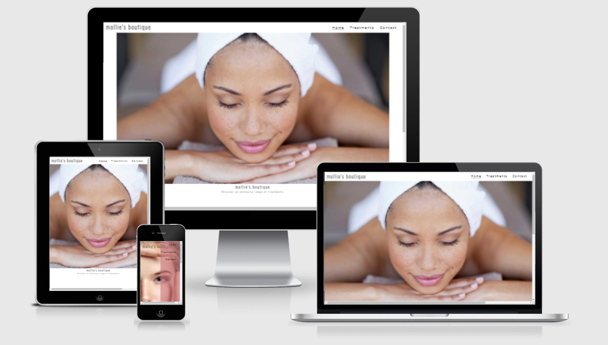
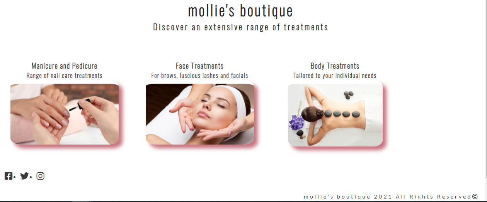
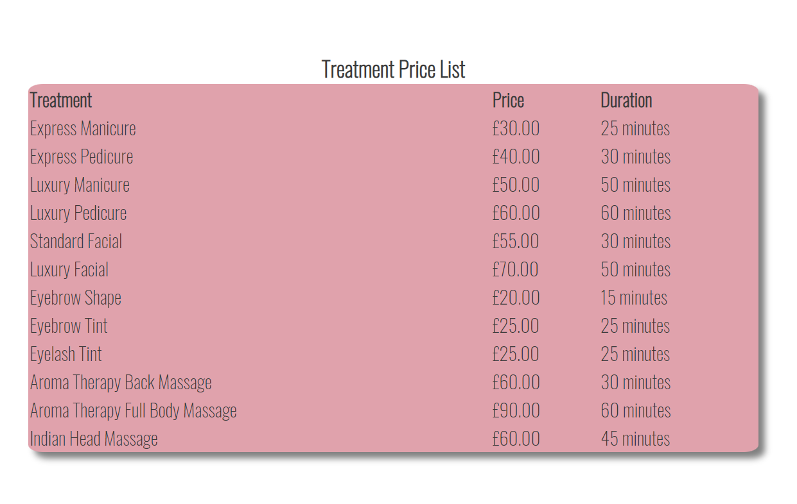
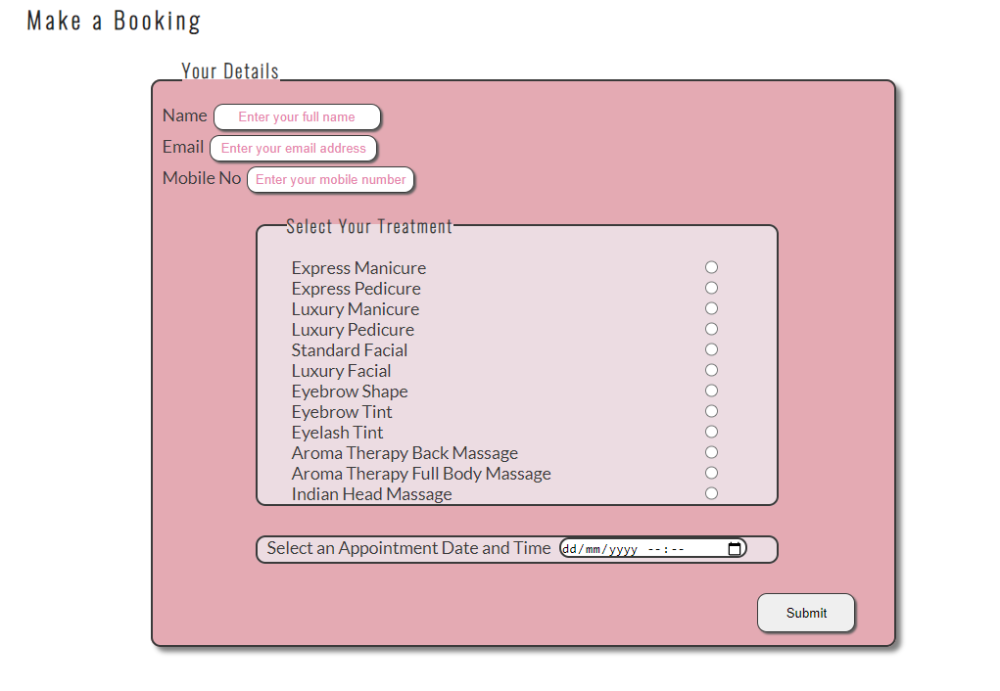
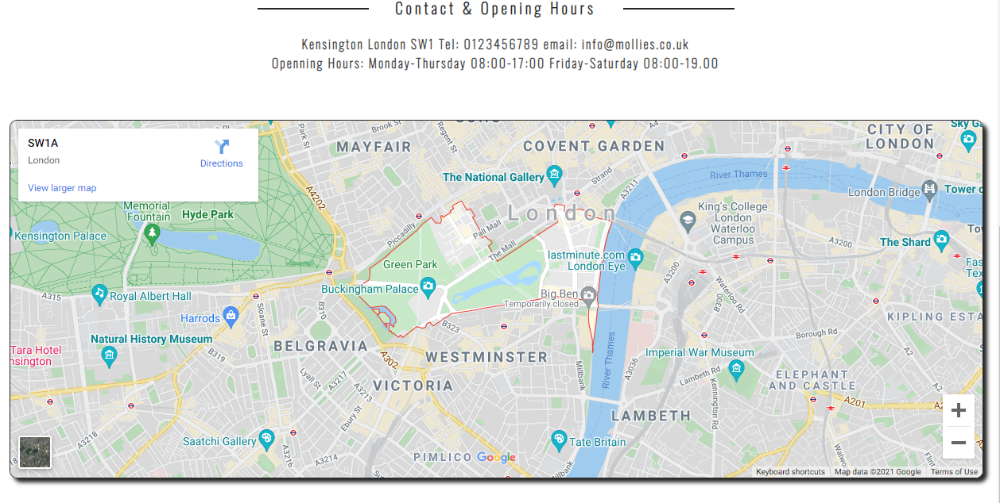

# mollie's boutique
Mollie's Boutique is a provider of beauty treatments, including facials, manicures, pedicures and massages.

The boutique is in its early stages of trading, and hopes to add to the range of services provided and to offer branded products in the future.

The live page can be viewed on [mollie's boutique website](https://anu1301.github.io/mollies-boutique/)

## Features
    
### Navigation:

    The company logo "mollie's boutique" links to the home page and will bring you back there when clicked on. 

    The navigation links at the top right hand corner has a hover function, which will appear when clicking on the other pages of the website. This function also remains visible according to the page you are on.

    The social media icons in the footer section of the website have links to the respective social media platform.

## mollie's boutique

### Images

    The images throughout show that the business is a beauty therapy provider. They have specifically been chosen as they have tones and hues of pinks and greys, which is in keeping with the website colour scheme.

    All the images, apart from the hero image on the landing page, have a shadow effect to give the image a slightly raised, 3-dimensional feel to them. The cordners have been rounded off to provide a softer visual effect.

### Treatments Page

    This page of the website gives a little information about the treatments on offer, which are accompanied by images corresponding to the treatment. Below this section a price list has been provided, which has been styled in keeping with the colour schemme.

    The font-family used is Oswald and Lato, which complement each other. The back up font used is sans-serif, should there be any issues in loading the chosen fonts. The font colour is a charcoal-grey or a very dark grey, which provides good contrast with the background.

    Testimonials provided below the price list, have been styled in keeping with the rest of the website.

### Contact Page

    This page contains a booking form, which has required fields for name, email and mobile number. The form also has radio buttons to enable the user to pick the treatment required, along with a date picker for the appointment.

    Contact details and opening hourse are provided below the form, along with an imbedded map of the salon area. 

### Technologies

Technologies used: HTML and CSS. A small amount of JavaScript

### Responsive

The site is responsive to smaller screens and mobile devices

### Testing

The html code was tested in W3C and css in jigsaw. Errors were then rectified.

Accessibility was tested through Site Improve and was found to be 96%

## Credits

Images were mainly obtained from iStock. The hero image was obtained from Champneys website, which under copyright law is permissible if being used for education purposes and not used for commercial or money gaining exploits.

Easy tutorials, Love Running with CI were also used. My mentor, Marcel also assisted me with the javascript.

