# mollie's boutique
## Introduction
Mollie's Boutique is a provider of beauty treatments, including facials, manicures, pedicures and massages.

The boutique is in its early stages of trading, and hopes to add to the range of services provided and to offer branded products in the future.

The live page can be viewed on [mollie's boutique website](https://anu1301.github.io/mollies-boutique/)

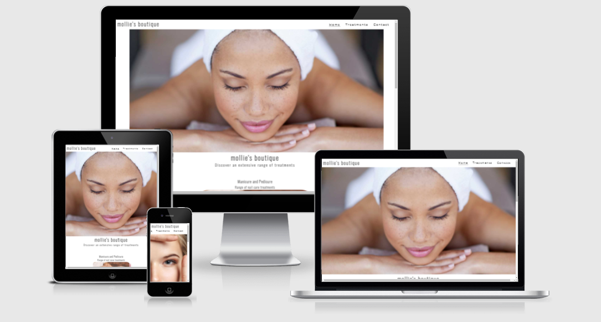

## Table of Contents
[1. User Expereince (UX)](#ux)

[2. Features](#features)

[3.Technologies Used](#technologies-used)

[4.Testing](#testing)

[5. Deployment](#deployment)

[6. Credits](#credits)

## User Experience (UX)
[Go up to the top](#table-of-contents)

The aim was to design a website that would provide an informative first contact of the business to the user and entice them to book with the salon for all their beauty therapy needs.

The target audience the website is aimed at is professional women within the agae range of 20 - 40, who want to be pampered.

The website provides three pages - the landing page to entice the user to explore further, treatment page providing treatments and prices and finally the contact page, where they can make their booking and find the contact details of the salon.
### User Goals
* To be able to find out what services are provided
* The cost of the services provided
* It is a trusted business and has potential for repeat business
* Location of the salon and contact details
* Links to social media platforms to follow the salon

### User Expectations

* The website is easy to navigate 
* The information is clearly presented
* The form is clear and easy to fill in 
* The website is responsive on various sized devices; therefore easy to access on the go.

## Features
[Go up to the top](#table-of-contents)
    
### Navigation:

The company logo "mollie's boutique" links to the home page and will bring you back there when selected. 

The navigation links, at the top right hand corner, have a hover function, which appear when selecting the pages of the website. This function also remains visible according to the page you are on.

The social media icons appear at the bottom of every page of the website, and are linked to the respective social media platforms. 

### Landing Page

#### The main hero image for larger devices
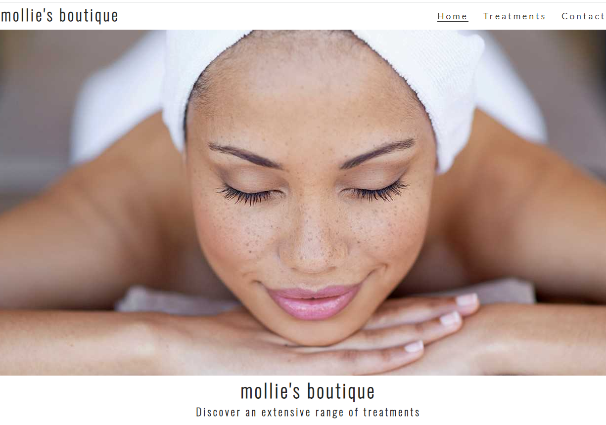

The hero image is the first thing the user sees. This image was chosen to invoke serenity, as well as give a feeling of pure indulgence - aimed at the target market.

#### The hero image for smaller devices
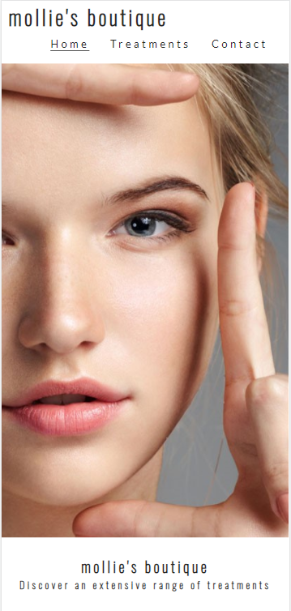

A different hero image has been used for smaller devices, due to the oddity of having a large face take up the small devices' view-port. The KB size of this image is smaller and therefore quicker load times on smaller devices.

#### Treatement images on landing page
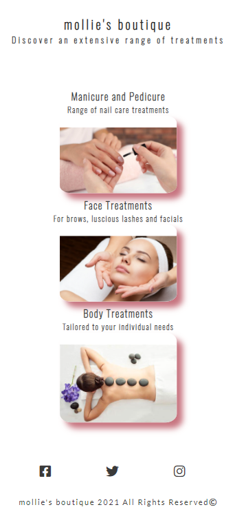

The images throughout show that the business is a beauty therapy provider. They have specifically been chosen as they have tones and hues of pinks and greys, which is in keeping with the website's main colour scheme.

### Treatments Page

This page of the website gives a little information about the treatments on offer, which are accompanied by images corresponding to the treatment. Below this section a price list has been provided, which has been styled in keeping with the colour schemme.

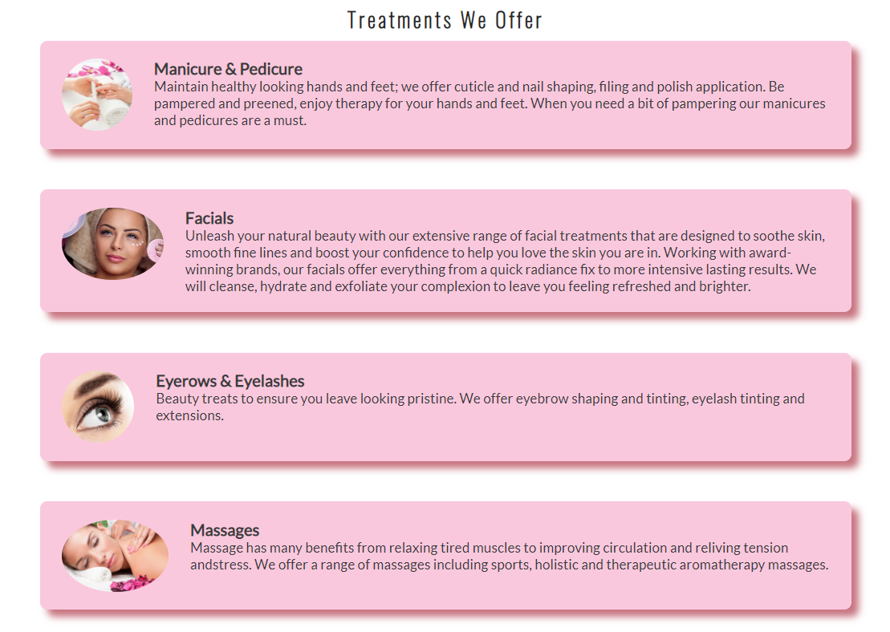

The font-family used is Oswald and Lato, which complement each other. The back up font used is sans-serif, should there be any issues in loading the chosen fonts. The font colour is a charcoal-grey or a very dark grey, which provides good contrast with the background.

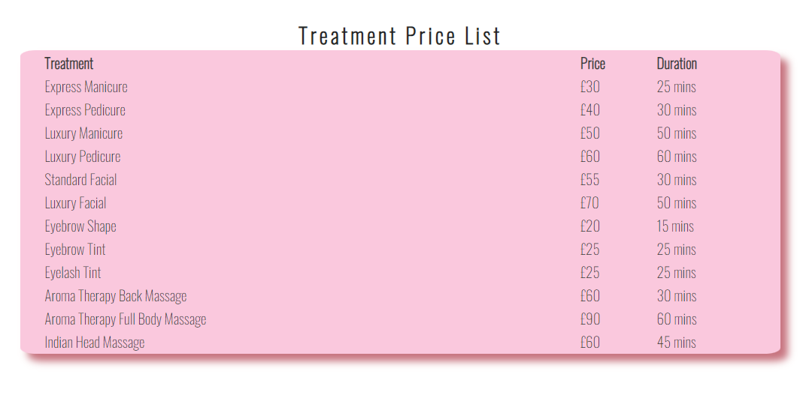

Testimonials provided below the price list, have been styled in keeping with the rest of the website.

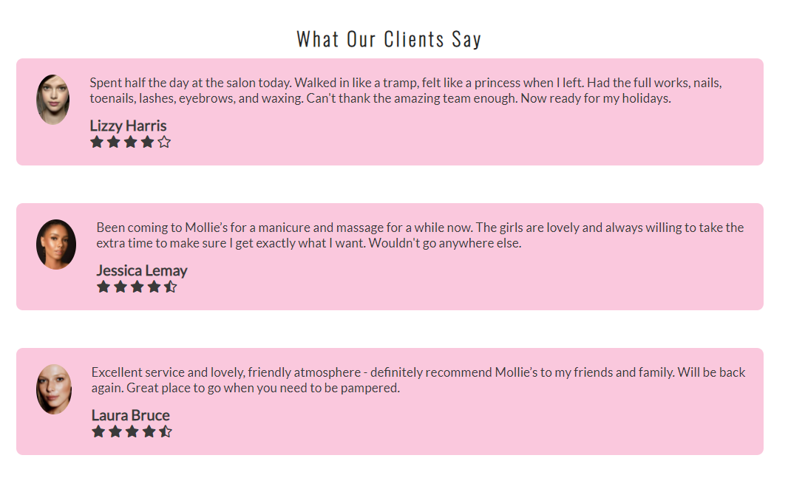
### Contact Page

This page contains a booking form, which has required fields for name, email and mobile number. The form also has radio buttons to enable the user to pick the treatment required, along with a date picker for the appointment.

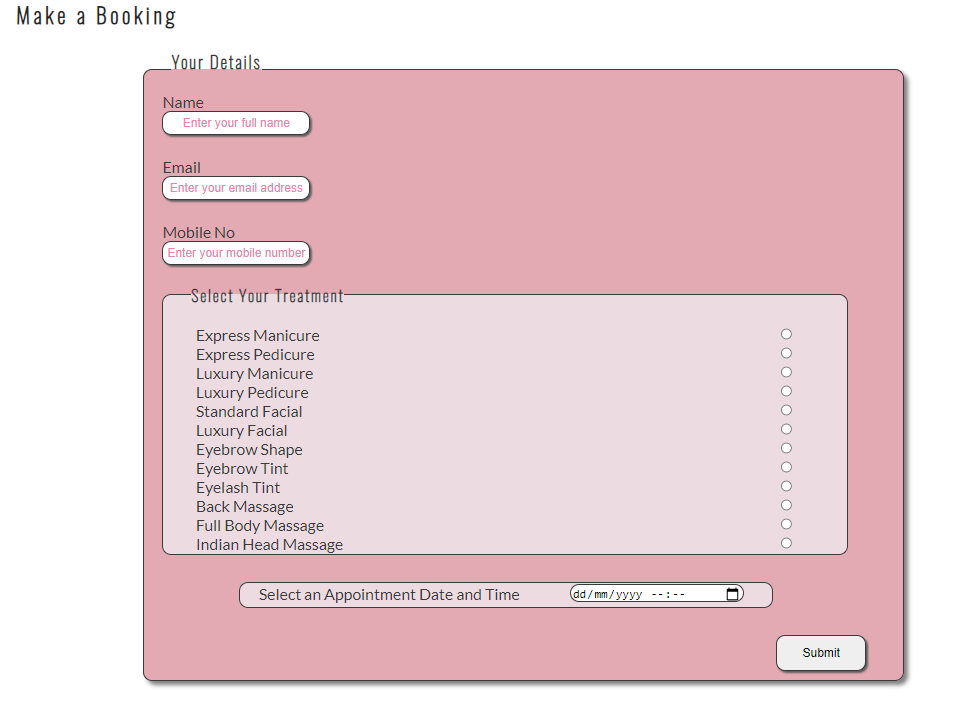

Contact details and opening hours are provided below the form, along with an imbedded map of the salon area. 

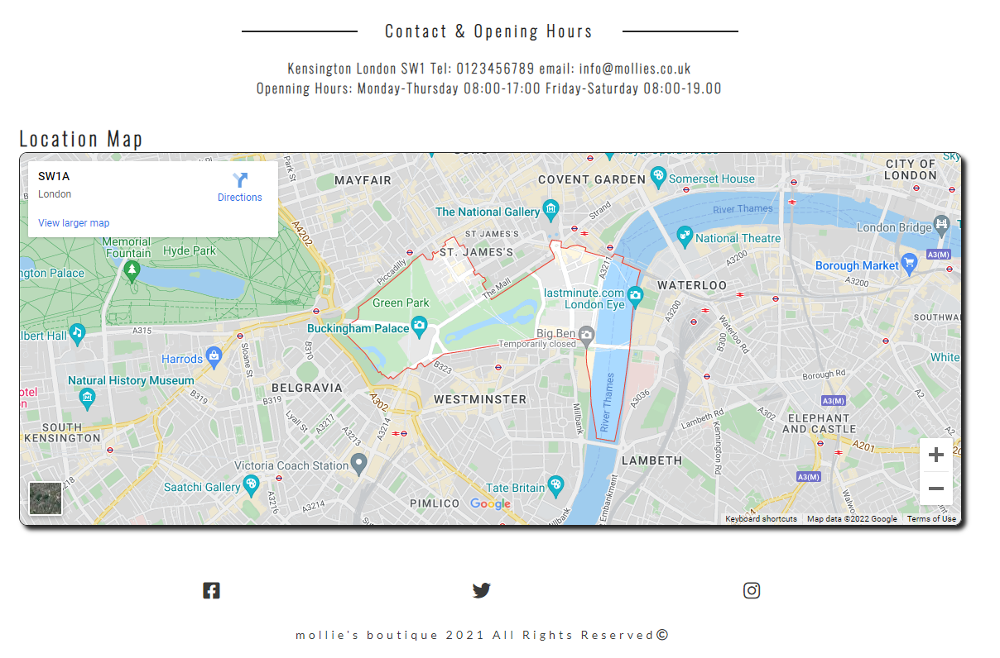

The imbedded map has a 'view larger map' and 'directions' - when either is selected the user is directed to google maps.

Some of the images, forms and location map have a shadow effect to give them a slightly raised, 3-dimensional feel to them. The corners have been rounded off to provide a softer visual effect, which is easier on the eye

## Technologies
[Go up to the top](#table-of-contents)
I used the following technologies in the website:

- HTML - for the structure of the website
- CSS - for the layout and presentation of the website
- GitHub - creation and storage of the repository
- GitPod - code editor (code commited and pushed to GitHub)

## Testing
[Go up to the top](#table-of-contents)

The html code was tested in W3C Markup and css in W3C Jigsaw. Errors were identified and rectified, with the following results:

#### index.html - tested in W3C Markup
##### before:
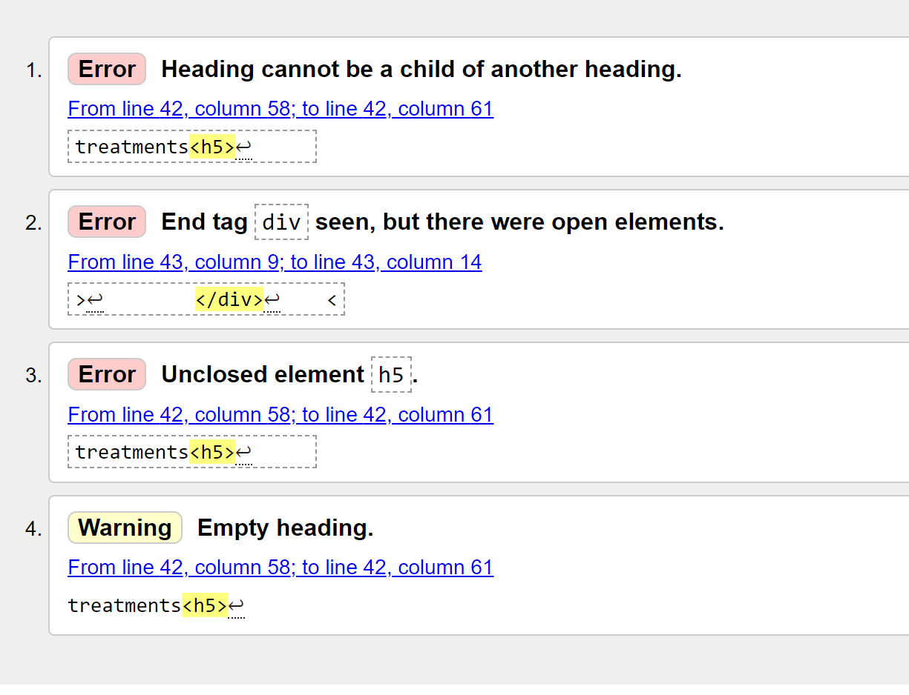
##### after:
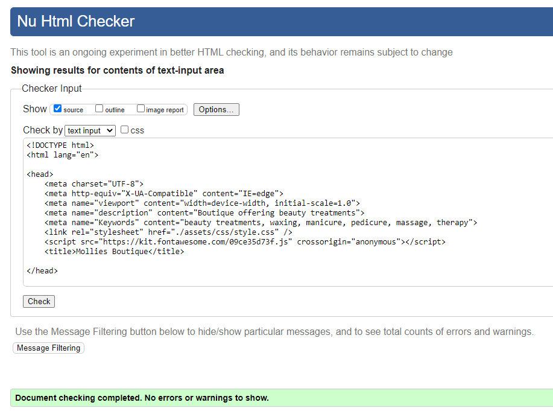
#### treatments.html - tested in W3C Markup
##### before:
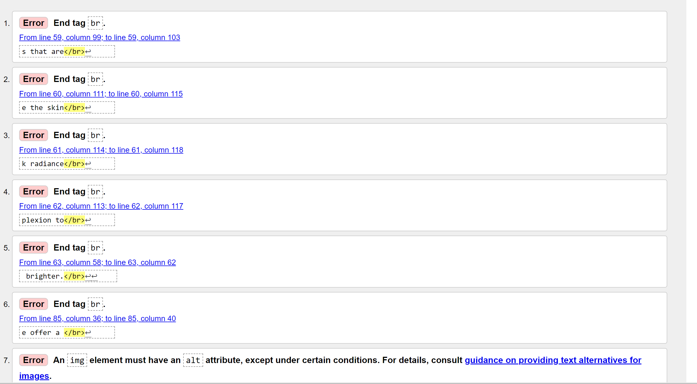
##### after:
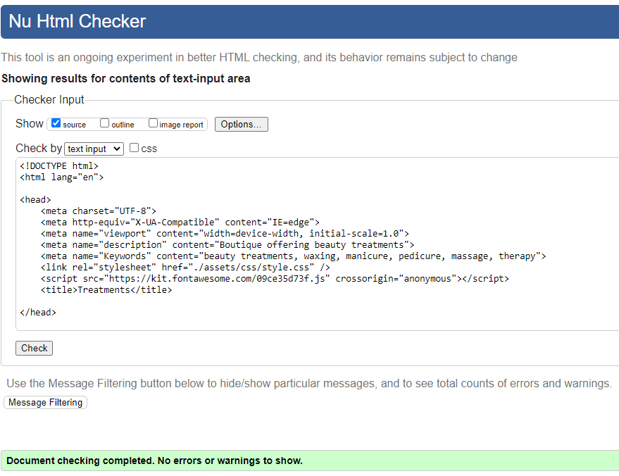

#### contacts.html - tested in W3C Markup
##### before:
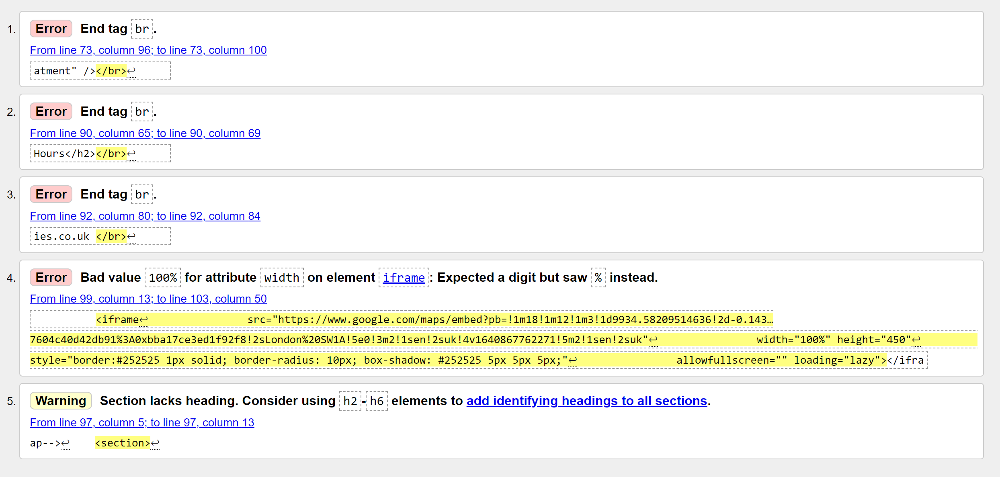
##### after:
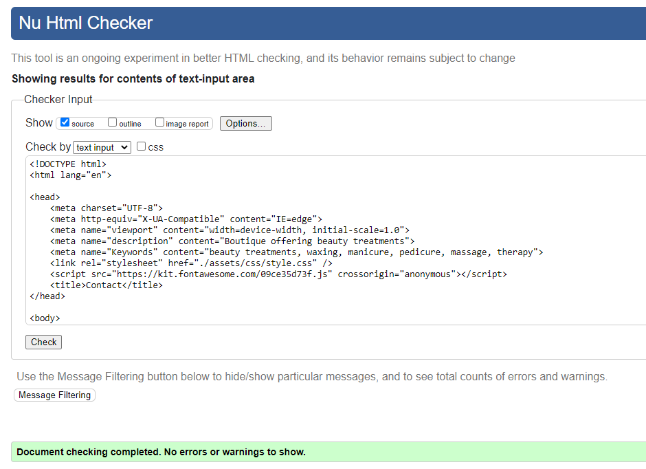

#### style.css - tested in W3C Jigsaw
##### before:

##### after:
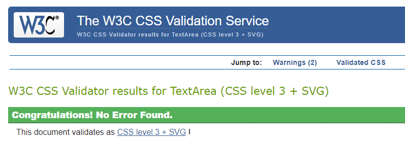

There are warnings from the validation results of the css file, which show the following results:

These warnings have not had a detrimental effect on the funcionality of the website.

Accessibility was tested through Site Improve and was found to be 96%

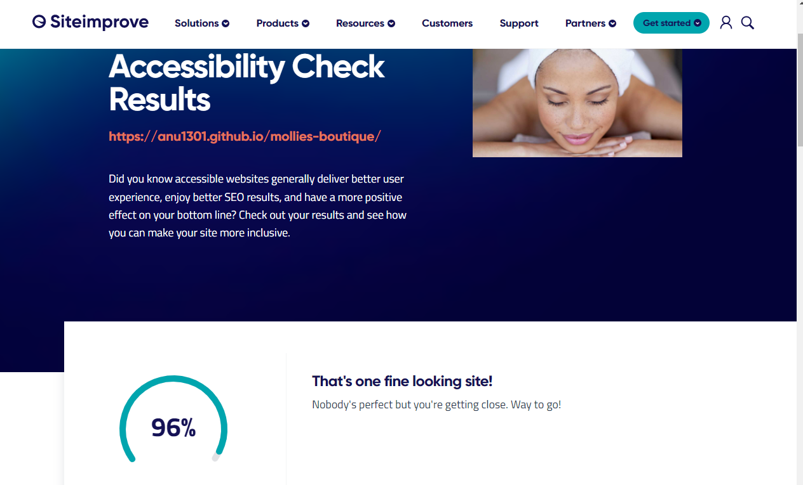

### Maual Testing
The website was tested manually by loading the website on a Samsung smart phone as well as a Kindle tablet and was found to be responsive. 

This was also tested via dev tools as follows:

* Responsive dimentions (page was draged back and forth to reduce/increase size of viewport on desk-top screen)
* iPhone SE
* iPhone XR
* iPhone 12 Pro
* Samsung Galexy S8
* iPad Air
* iPad Mini

The website was tested using the following browsers:
* Microsoft Edge
* Google Chrome

The features were tested as follows:

* The navigation links were tested and they behaved as expected, i.e. the links take you to the respective pages.
* The logo, 'mollie's boutique', works as expected, i.e. when selected brings you back to the home page.
* The social network icons, when selected, take you to their respective websites.
* The booking form requires you to enter name, email and mobile number, and does not allow you to submit the form without completing these. The user is prompted when trying to submit the form without completing the required fields.
* The email field recognises the email format and prompts you if it has not been complted correctly.
* If the required fields are correctly completed and the submit button selected, the user is directed to the https://formdump.codeinstitute.net/ (the Code Institute form dump).
* The imbedded map behaves as expected when 'view larger map' and/or 'directions' are selected. Both times it took me to google maps.

## Deployment
[Go up to the top](#table-of-contents)

The site was deployed to GitHub pages, as the repository was created through GitHub, using the following method:

- Navigate to the settings tab in the mollies boutique repository in GitHub.

- Select pages on the left-hand side menu

- From the source section drop-down menu, select the Master Branch and save

- The page will be automatically refreshed with a detailed ribbon display to indicate the successful deployment. 

- The live link can be found at the top of this document

## Credits
[Go up to the top](#table-of-contents)

Images were mainly obtained from iStock. 

The main hero image and the nail care image on the landing page were obtained from Champneys website. Under copyright law it is permissible to use these imaged if they are being used for educational purposes and not used for commercial or money making exploits. This project is an educational project and is not intended to make money - as mollies boutique is a fictional website and has no bearing to any trading business.

Easy tutorials and Love Running with CI were also used. 

Marcel Mulder, my mentor, for his encouragement and support throught the process.

