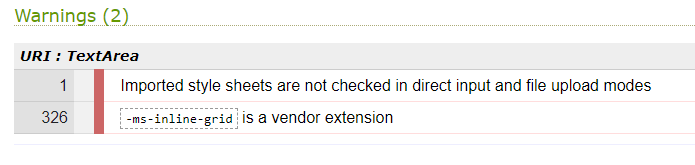

# mollie's boutique
## Introduction
Mollie's Boutique is a provider of beauty treatments, including facials, manicures, pedicures and massages.

The boutique is in its early stages of trading, and hopes to add to the range of services provided and to offer branded products in the future.

The live page can be viewed on [mollie's boutique website](https://anu1301.github.io/mollies-boutique/)

## Table of Contents
[1. User Expereince (UX)](#ux)

[2. Features](#features)

[3.Technologies Used](#technologies-used)

[4.Testing](#testing)

[5. Deployment](#deployment)

[6. Credits](#credits)

## User Experience (UX)
[Go up to the top](#table-of-contents)

The aim was to design a website that would provide an informative first contact of the business to the user and entice them to book with the salon for all their beauty therapy needs.

The target audience the website is aimed at is professional women within the agae range of 20 - 40, who want to be pampered.

The website provides three pages - the landing page to entice the user to explore further, treatment page providing treatments and prices and finally the contact page, where they can make their booking and find the contact details of the salon.
### User Goals
* To be able to find out what services are provided
* The cost of the services provided
* It is a trusted business and has potential for repeat business
* Location of the salon and contact details
* Links to social media platforms to follow the salon

### User Expectations

* The website is easy to navigate 
* The information is clearly presented
* The form is clear and easy to fill in 
* The website is responsive on various sized devices; therefore easy to access on the go.

## Features
[Go up to the top](#table-of-contents)
    
### Navigation:

The company logo "mollie's boutique" links to the home page and will bring you back there when clicked on. 

The navigation links at the top right hand corner has a hover function, which will appear when clicking on the other pages of the website. This function also remains visible according to the page you are on.

The social media icons in the footer section of the website have links to the respective social media platform.

### Landing Page

#### The main hero image for larger devices

#### The main hero image for smaller devices

#### Treatement images on landing page

The images throughout show that the business is a beauty therapy provider. They have specifically been chosen as they have tones and hues of pinks and greys, which is in keeping with the website's main colour scheme.

### Treatments Page

This page of the website gives a little information about the treatments on offer, which are accompanied by images corresponding to the treatment. Below this section a price list has been provided, which has been styled in keeping with the colour schemme.

The font-family used is Oswald and Lato, which complement each other. The back up font used is sans-serif, should there be any issues in loading the chosen fonts. The font colour is a charcoal-grey or a very dark grey, which provides good contrast with the background.

Testimonials provided below the price list, have been styled in keeping with the rest of the website.

### Contact Page

This page contains a booking form, which has required fields for name, email and mobile number. The form also has radio buttons to enable the user to pick the treatment required, along with a date picker for the appointment.

Contact details and opening hourse are provided below the form, along with an imbedded map of the salon area. 

Some of the images, forms and location map have a shadow effect to give them a slightly raised, 3-dimensional feel to them. The corners have been rounded off to provide a softer visual effect, which is easier on the eye

## Technologies
I used the following technologies in the website:

- HTML
- CSS

## Testing

The html code was tested in W3C and css in jigsaw. Errors were identified and rectified, with the following results:

#### index.html

#### treatments.html

#### contacts.html

#### style.css

There are warnings from the validation results of the css file, which show the following results:

These warnings have not had a detrimental effect on the funcionality of the website.

Accessibility was tested through Site Improve and was found to be 96%

### Maual Testing
The website was tested manually by loading the website on a Samsung smart phone as well as a Kindle tablet and was found to be responsive. This was also tested via dev tools on various other sizes.

## Deployment
[Go up to the top](#table-of-contents)

The site was deployed to GitHub pages, as the repository was created through GitHub, using the following method:

- Navigate to the settings tab in the mollies boutique repository.

- Select pages on the left-hand side menu

- From the source section drop-down menu, select the Master Branch and save

- The page will be automatically refreshed with a detailed ribbon display to indicate the successful deployment. 

- The live link can be found at the top of this document

## Credits

Images were mainly obtained from iStock. The main hero image was obtained from Champneys website, which under copyright law is permissible if being used for education purposes and not used for commercial or money gaining exploits.

Easy tutorials and Love Running with CI were also used. 

Marcel Mulder, my mentor, for his encouragement and support throught the process,

